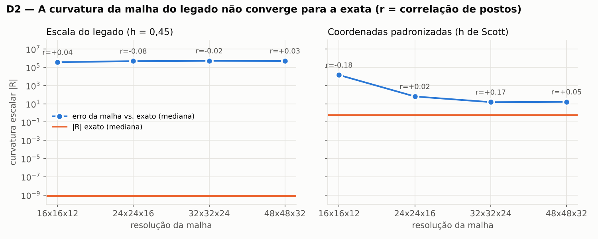
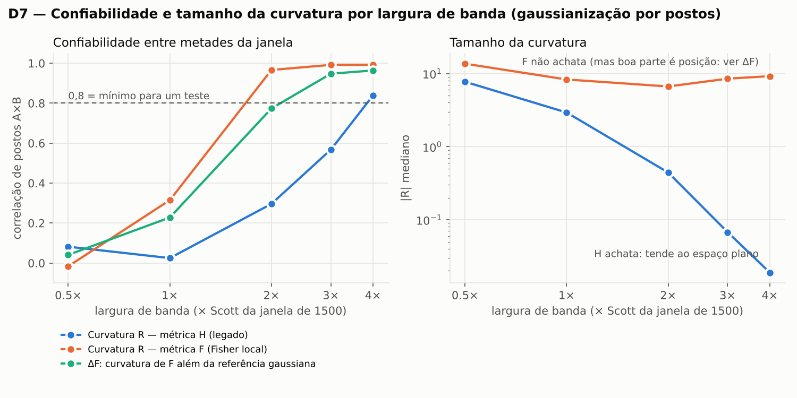

# Diagnóstico da camada geométrica do SGV — rodada de calibração

**Data:** 08/10/2026 · **Dados:** sintéticos (GARCH(1,1) com choques t de 4 graus, na escala do BTC 1m: desvio ≈ 0,07% por minuto) · **Objeto:** os 10 arquivos em `legacy/`, sem nenhuma alteração · **Revisão:** conferido por um revisor independente (matemática, causalidade e todos os números contra as saídas). As correções que ele pediu já estão aplicadas.

**Conclusão.** Na forma atual, a camada geométrica não mede o mercado. Os tensores saem de erro numérico, quase todas as camadas usam informação futura, e a versão exata da métrica do legado (a Hessiana da surpresa) é ruído de amostra onde tem curvatura e plana onde é estável. A alternativa mais promissora é a **métrica de Fisher local** com coordenadas gaussianizadas por postos. Ela é mensurável, mas a maior parte da sua curvatura vem da **posição** do ponto e da **volatilidade**, não da forma da distribuição. O que sobra além disso (ΔF, a curvatura de F menos a de uma gaussiana ajustada à mesma janela) é a única candidata a "geometria do mercado". Num GARCH, ela não passa no portão G1 (falha em 3 dos 4 critérios), o que é o esperado: ali não há geometria além da volatilidade. A Fase 1 mede se o BTC real se afasta desse baseline.

Esta rodada usa dados sintéticos de propósito. Ela calibra os instrumentos e mostra o que o código faz quando, por construção, não há nada a descobrir além da volatilidade. Nenhum dado real foi gasto e nenhum retorno futuro foi olhado. Arquivos de cada diagnóstico: `reports/sintetico/`.

---

## D1 — O que as colunas do legado carregam

| Grandeza do legado | O que sai | Leitura |
| --- | --- | --- |
| `field_curvature_scalar` (R 3D) | mediana +1,2×10⁵; p5/p95 −8,2×10⁵ / +9,4×10⁵; 1,5% no corte de ±10⁶ | ordem de grandeza de erro numérico (D2) |
| `field_einstein_norm` | ≥ 10⁶ em 99,98% das barras | idem |
| `field_stress_tensor_norm` | coeficiente de variação 2×10⁻⁶ | constante |
| `rupture_prob_geodesic` | mediana 0,945 | "ruptura" em toda barra |
| `information_density` | 1,2992; desvio de 5×10⁻⁵ após o aquecimento | o KDE vira uma gaussiana só |
| `sgv_singularity_type` | "gravity" em 95% das barras | tipo dominado por um termo |
| `is_high_critical` (ao vivo) | verdadeiro em 99,5% das barras | limiar 0,70 aplicado a um escore que vai de 1,4 a 6,6 |
| Duplicatas exatas na camada geodésica | 10 pares (ex.: `g_trace` = `field_curvature`, `g_det` = `g_det_safe`) | colunas redundantes |

As coordenadas que entram no KDE 3D têm desvio de 4,6×10⁻⁶ (E = v²+a²), 1,5×10⁻³ (jerk) e 2,2×10⁻⁷ (memory_flux), contra larguras de banda de 0,35 (2D) e 0,45 (3D). O dado real do repositório (132 barras ao vivo de 31/03/2026) repete o padrão: R batendo em ±10⁶, stress e probabilidade de ruptura constantes.

## D2 — Malha do legado contra derivadas exatas

- **Na escala do legado, a geometria exata é espaço plano.** O |R| mediano exato é 7,6×10⁻¹⁰ (máximo 0,32). A malha dá |R| entre 10⁵ e 10⁶ em todas as resoluções, e a correlação de postos com o valor exato fica entre −0,08 e +0,04. Refinar a malha não aproxima: é erro de arredondamento amplificado.
- **Com coordenadas padronizadas, a malha continua inutilizável.** O erro mediano cai de 1,4×10⁴ para cerca de 16, mas a correlação de postos com o exato oscila entre −0,18 e +0,17, sem tendência.

A curvatura precisa de derivadas exatas, sem malha, e é isso que `sgvgeo/` faz. O código foi conferido contra casos de resposta conhecida (`tests/`): espaço plano dá R = 0, as esferas S² e S³ dão R = 2 e R = 6. O revisor acrescentou checagens próprias (plano hiperbólico R = −2, métricas puxadas por mapas não lineares), todas de acordo.

## D3 — Vazamento de futuro

Teste do prefixo: cada camada foi calculada com 2.400 barras e de novo com 3.200. Nas barras antigas, o valor não deveria mudar.

| Camada | Colunas com barras alteradas | Barras alteradas (mediana entre colunas) |
| --- | --- | --- |
| geodesic | 64 de 99 | 100% |
| singularity | 108 de 152 | 100% |
| terrain | 27 de 33 | 100% |
| expected_value | 38 de 44 | 99,7% |
| alignment | 42 de 50 | 99,4% |
| edge | 48 de 57 | 97,4% |
| input | 2 de 16 (`E_norm` com z-score global; `input_valid`, que usa `ret_fwd_5m`) | — |
| info | 1 de 20 (`input_valid`, herdada do input, nas últimas 5 barras) | 0% |

**Ao vivo** (`run_sgv_runtime`, 13 pares de janelas): quando chega a barra seguinte, os valores geométricos da barra já fechada mudam em 100% dos casos. O `edge_score` muda em 77%, o sinal de entrada (`sgv_edge_signal`) inverte em 15% e o `terrain_state` em 8%. O sistema repinta o passado.

## D4 — Geometria exata e causal

O KDE é ajustado só nas 1.500 barras anteriores, com reajuste a cada 60, sobre as mesmas coordenadas do legado. As métricas comparadas:

- **H** = ∇²(−log ρ), a informação observada. É a métrica do legado. Equivale a H = (I − Cov_w(u))/h², e deixa de ser positiva onde os vizinhos se espalham mais que o kernel.
- **F** = média local de ∇φ∇φᵀ, a informação de Fisher restrita à vizinhança. Pela identidade da informação, E[H] = E[F], mas F é positiva semidefinida em todo ponto.
- **Fref**: a mesma construção de F, com o escore de uma gaussiana ajustada à janela.
- **ΔF** = slog R(F) − slog R(Fref): o que a forma da distribuição acrescenta à curvatura.

A largura de banda é dada em múltiplos de Scott(1500) = 0,351.

| | z-score robusto, 1× | Postos, 1× | Postos, 2× |
| --- | --- | --- | --- |
| H indefinida (ao menos um autovalor < 0) | 47,5% | 50,0% | 10,6% |
| Troca de assinatura de uma barra para a seguinte | 47,9% | 50,0% | 18,0% |
| Duração média de um regime de assinatura | 2,1 barras | 2,0 barras | 5,6 barras |
| H: barras com \|R\| > 100 | 10,2% | 12,5% | 4,8% |
| H: explosões de R entre os 10% menores \|det g\| | 63% | 59% | 99% |
| F: barras com \|R\| > 100 | 6,3% | 0,6% | 0% |
| Correlação de postos entre curvatura de F e de Fref | 0,17 | 0,41 | **0,83** |
| Correlação de postos entre curvatura de F e distância ao centro | −0,36 | −0,30 | **−0,68** |
| Correlação de postos entre ΔF e distância ao centro | −0,10 | 0,20 | −0,21 |
| Autocorrelação de 1 barra: curvatura de F / ΔF | 0,15 / 0,06 | 0,13 / 0,03 | 0,28 / 0,12 |

- **A assinatura de H troca a cada duas barras, como uma moeda.** Na largura natural, a ideia de usar a troca de assinatura como evento de "ruptura" não sobrevive: não há regime para romper. Na largura dupla, quase todas as explosões de R estão onde det g → 0.
- **A curvatura de F, na configuração estável (postos, 2×), é sobretudo posição.** Ela anda com a curvatura da gaussiana de referência (0,83) e com a distância ao centro (−0,68). Por isso a grandeza candidata é ΔF.
- **O z-score robusto produz outliers.** O |z| chega a 556 (p99 de 31). Em 1,5% das barras o ponto fica sem vizinhos: a geometria é trivialmente plana (R = 0 exato) e F é singular. A gaussianização por postos elimina esse problema.

## D5 — Geometria ou volatilidade?

R² fora da amostra (5 blocos contíguos, gradient boosting) de cada grandeza explicada por volatilidade passada (10, 30 e 60 barras) e por |v| e |a| da barra. Para comparação, o mesmo R² usando as próprias coordenadas da barra.

| Grandeza | R² pela volatilidade, postos 1× | R² pela volatilidade, postos 2× | R² pelas coordenadas, postos 2× |
| --- | --- | --- | --- |
| φ (surpresa) | 0,64 | 0,79 | 0,95 |
| F: curvatura R | 0,19 | **0,80** | 0,95 |
| Fref: curvatura R | 0,42 | 0,81 | 0,91 |
| **ΔF** | 0,17 | **0,65** | 0,85 |
| H: curvatura R | −0,04 | 0,13 | 0,25 |
| H: nº de autovalores negativos | 0,12 | 0,17 | 0,36 |

Na configuração estável, 80% da curvatura de F e 65% de ΔF são volatilidade. Num GARCH isso é o esperado, porque toda a estrutura é volatilidade. No BTC real, ΔF só conta como geometria própria se esse número cair bem abaixo (critério 4 do G1). A curvatura de H não é explicada nem pelas próprias coordenadas na largura natural: ela não é função do estado, e D7 mostra que é ruído do KDE.

## D6 — Física da informação: vale G = κT?

O legado monta, sobre a mesma métrica H, o tensor de Einstein G e um "tensor energia-momento" T feito da surpresa φ e do campo λ, e depois os multiplica num índice de "gravidade". Uma leitura física exige G = κT com κ estável.

| | z-score robusto 1× | Postos 1× | Postos 2× |
| --- | --- | --- | --- |
| R² com um κ único para a série | 0,003 | 0,08 | 0,003 |
| R² com κ livre em cada barra (teto otimista) | 0,43 | 0,48 | 0,22 |
| Barras com κ > 0 | 49,7% | 50,9% | 49,1% |

Não há equação de campo: o sinal de κ é cara ou coroa. O termo 0,25·λ·g responde por menos de 1% de |T| (mediana entre 0,5% e 0,8%; λ mediano ≈ 2,2×10³, sem escala). O que pesa em T são os produtos dos gradientes. O índice `field_gravity` multiplica duas grandezas sem relação entre si.

## D7 — A curvatura é mensurável?

A janela de ajuste foi dividida em duas metades intercaladas, cada uma gerando seu KDE, com a mesma largura usada na janela inteira. A confiabilidade é a correlação de postos entre as duas versões, em 240 barras: 1 indica propriedade do estado, 0 indica ruído da amostra. A medida é conservadora, porque cada metade tem só 750 barras.

| Confiabilidade (gaussianização por postos) | 0,5× | 1× | 2× | 3× | 4× |
| --- | --- | --- | --- | --- | --- |
| H: curvatura R | 0,08 | 0,03 | 0,30 | 0,57 | 0,84 |
| H: indefinida (0/1) | 0,20 | 0,17 | 0,08 | −0,01 | — |
| F: curvatura R | −0,02 | 0,32 | 0,97 | 0,99 | 0,99 |
| Fref: curvatura R | 0,11 | 0,61 | 0,94 | 0,98 | 0,98 |
| **ΔF** | 0,04 | 0,23 | **0,77** | **0,95** | **0,96** |
| φ | 0,82 | 0,95 | 0,99 | 0,99 | 0,99 |

- **H é ruído onde tem curvatura e plana onde é estável.** Com 4× a confiabilidade chega a 0,84, mas o |R| mediano cai para 0,02.
- **F é estável a partir de 2×**, mas boa parte disso é a referência gaussiana, que também é estável.
- **ΔF fica logo abaixo de 0,8 com 2× (0,77) e passa com 3× (0,95).** A largura final de ΔF se escolhe na Fase 1, por este mesmo diagnóstico rodado no dado real (`SGV_HMULT`).

No z-score robusto, nenhuma grandeza de curvatura chega a 0,8 abaixo de 4×.

## D8 — Teste de existência contra séries substitutas

Configuração: postos, 2× Scott, janela de 1.500 (a rodada com 3× está na seção seguinte), com 19 réplicas para cada nulo e p-valor por postos (resolução 0,05). Como o "real" aqui já é um GARCH, o resultado correto contra o substituto GARCH é **não rejeitar**.

| Estatística | p contra GARCH ajustado | p contra IAAFT | p contra embaralhado |
| --- | --- | --- | --- |
| H positiva definida | 0,60 | 0,05 | 0,05 |
| Troca de assinatura de H | 0,40 | 0,10 | 0,05 |
| Mediana da curvatura de H | 0,45 | 0,15 | 0,35 |
| Mediana da curvatura de F | 0,80 | 0,95 | 0,60 |
| **Mediana de ΔF** | 0,45 | 0,45 | 0,90 |
| **Média de ΔF** | 0,25 | 0,05 | 0,05 |
| Mediana de log det F | 0,50 | 0,05 | 0,05 |
| Autocorrelação de φ | 0,30 | 0,05 | 0,05 |

- **Contra o GARCH, nenhuma estatística rejeita** (p ≥ 0,25). É uma única série, então isso não mede a taxa de falso positivo, só mostra que este caso não a produziu.
- **Contra os nulos que destroem o agrupamento de volatilidade, várias rejeitam no limite da resolução.** É o caso da média de ΔF, de log det F e da autocorrelação de φ. O teste enxerga o agrupamento de volatilidade.
- **A mediana da curvatura de F e a mediana de ΔF não distinguem nada.**

Duas consequências para a Fase 1. Com 19 réplicas, p ≤ 0,05 exige que a série seja a mais extrema de 20, sem folga, então o nulo GARCH usará 39 réplicas. E a estatística primária será a média de ΔF, a única de ΔF que mostrou sensibilidade.

## Calibração do portão G1

O plano fixa a regra: a largura de banda é o menor múltiplo, entre 2× e 4×, em que ΔF atinge confiabilidade ≥ 0,8. No GARCH sintético, a regra escolhe 3×. Os diagnósticos foram rodados de novo nessa largura (`SGV_HMULT=3`), e o GARCH, onde por construção não há geometria além da volatilidade, **não passa no portão**:

| Critério do G1 | Valor no GARCH (3×) | Resultado |
| --- | --- | --- |
| 1. Confiabilidade de ΔF ≥ 0,8 (D7) | 0,95 | passa |
| 2. \|correlação de postos de ΔF com a distância ao centro\| < 0,5 (D4) | 0,62 | falha |
| 3. Média de ΔF difere do GARCH ajustado, p ≤ 0,05 (D8) | p = 0,85 | falha |
| 4. R² de ΔF pela volatilidade ≤ 0,5 (D5) | 0,85 | falha |

Há um conflito embutido: quanto maior a largura, mais estável fica ΔF e mais ele se reduz a posição e volatilidade. Com 2×, ΔF é menos explicado pela volatilidade (0,65) e pela posição (0,21), mas não é estável o bastante (0,77). O dado real precisa achar uma faixa onde as duas coisas convivam, e no GARCH ela não existe. Com 3×, a média de ΔF também deixa de distinguir os nulos que destroem o agrupamento de volatilidade (p = 0,15 e 0,10). Arquivos: `d4_geometria_exata.json` (configuração `rank_gauss_h3x`), `d5_volatilidade.json` e `d8_existencia_h3x.json`.

---

## O que isso decide para a Fase 1

1. **Métrica:** Fisher local (F), não H. Isso inverte a recomendação anterior da opção (a), feita antes destas medições.
2. **Grandeza candidata:** ΔF, a curvatura de F além da referência gaussiana. A curvatura de F sozinha é quase toda posição e volatilidade.
3. **Escala:** gaussianização causal por postos.
4. **Largura de banda:** o menor múltiplo de Scott entre 2× e 4× com confiabilidade de ΔF ≥ 0,8, escolhido por D7 no dado real antes de qualquer outro diagnóstico.
5. **Controles obrigatórios:** volatilidade (D5), referência gaussiana (embutida em ΔF), substituto GARCH ajustado com 39 réplicas (D8).
6. **Fora do teste:** o índice de gravidade, o par G/T (D6) e a troca de assinatura de H como evento de ruptura (D4).
7. **Escala de tempo:** em 1m, as coordenadas (v, a, jerk) quase não têm memória e a geometria herda isso (autocorrelação de ΔF entre 0,03 e 0,12). Rodar a bateria também em 1h antes de escolher.
